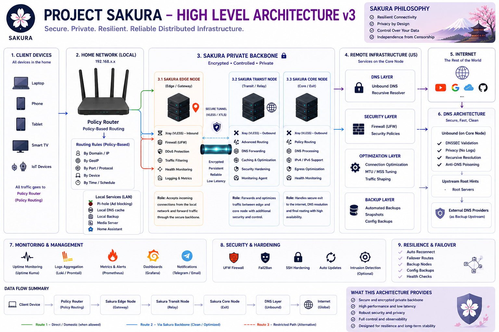

# 🌸 Project Sakura

> Secure. Private. Resilient. Reliable Distributed Infrastructure.




## Project Sakura v3.1 Update

Project Sakura v3.1 extends the architecture with:

- MIERU — AI Observability Layer
- MITA — AI Threat Analysis Layer
- PlayStation and Xbox connectivity support
- Console-aware routing visibility
- NAT behavior analysis
- Low-latency connectivity monitoring

MIERU and MITA do not replace the core Sakura node roles. They provide observability, threat analysis, and operational intelligence around the existing infrastructure.

For details, see [Architecture v3.1](docs/architecture-v3.1.md).

## Quick Facts

* 🌍 Designed for distributed environments
* 🔐 Security-first architecture
* 📊 Observability-driven operations
* ♻️ Real-world incident recovery
* 🇯🇵 English + Japanese documentation

---

Project Sakura is a real-world infrastructure engineering project designed, built, and continuously improved to provide secure, resilient, and privacy-focused connectivity across distributed environments.

This project demonstrates practical experience in:

* Network Security
* Linux Infrastructure
* Policy-Based Routing
* DNS Security
* Distributed Architecture
* Monitoring and Observability
* Performance Optimization
* Resilience Engineering

---

# 📁 Repository Structure

```text
project-sakura/
├── README.md
├── README_JP.md
├── LICENSE
├── .gitignore
├── assets/
├── docs/
│   ├── architecture.md
│   ├── architecture_JP.md
│   ├── security-model.md
│   ├── security-model_JP.md
│   ├── lessons-learned.md
│   ├── lessons-learned_JP.md
│   ├── metrics.md
│   ├── metrics_JP.md
│   ├── roadmap.md
│   ├── roadmap_JP.md
│   └── diagrams/
└── examples/
```

---

# 📖 Project Overview

Project Sakura was created to solve real-world connectivity, reliability, privacy, and operational challenges in complex network environments.

Rather than building a laboratory environment, Project Sakura was developed as a production-grade infrastructure platform with long-term operational stability in mind.

---

# 🏗 Architecture

The architecture consists of multiple independent layers:

## 1. Local Infrastructure

* Client devices
* Policy-based routing
* Local DNS services
* Service segmentation

## 2. Private Backbone

* Edge Node
* Transit Node
* Core Node
* Encrypted persistent transport

## 3. Remote Infrastructure

* Recursive DNS
* Security policies
* Traffic optimization
* Backup systems

## 4. Monitoring Layer

* Uptime monitoring
* Metrics collection
* Log aggregation
* Alerting

---

## 📚 Additional Documentation

- [Node Inventory](docs/node-inventory.md)

---

# 🔐 Security Philosophy

Project Sakura follows:

* Privacy by Design
* Least Privilege
* Defense in Depth
* Operational Visibility
* Continuous Hardening

These principles allow Project Sakura to achieve high reliability, operational stability, and long-term security resilience.

---

# ⚡ Technical Areas

Technologies and concepts used:

* Linux Infrastructure
* SSH Remote Administration
* Firewall Management
* DNS Infrastructure
* Policy-Based Routing
* Traffic Optimization
* Observability
* Backup Automation
* Service Hardening

These technologies are applied with long-term operational stability, incident response, and continuous improvement in mind.

---

# 📚 Lessons Learned

Project Sakura was built through real operational experience, continuous troubleshooting, optimization, incident response, and long-term refinement.

Key areas of learning include:

* Distributed system reliability
* Network performance tuning
* Failure recovery
* Operational monitoring
* Secure infrastructure design
* Continuous improvement (Kaizen)

Project Sakura is not simply a technical project.

It is an engineering platform that continues to evolve through real-world experience.

---

# 🚀 Future Development

Project Sakura continues to evolve.

Planned areas of future development include:

* Expanded wireless infrastructure
* Advanced telemetry
* Infrastructure automation
* Configuration management
* Additional failover scenarios
* Enhanced security monitoring

Project Sakura is never considered complete.

Improvement, learning, and evolution define its core philosophy.

---

# 👤 Author

Amir Borisov

Senior Network Security Engineer
Infrastructure • Security • Linux • Reliability Engineering

---

> Project Sakura is not a laboratory environment.
> It is a real-world engineering platform shaped by challenges, experience, improvement, and purpose.
